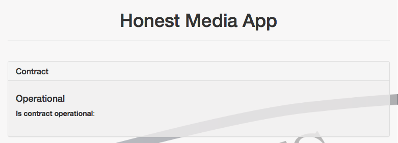
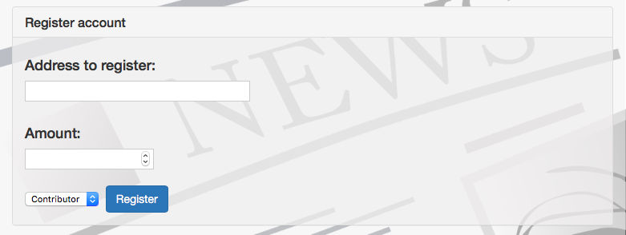
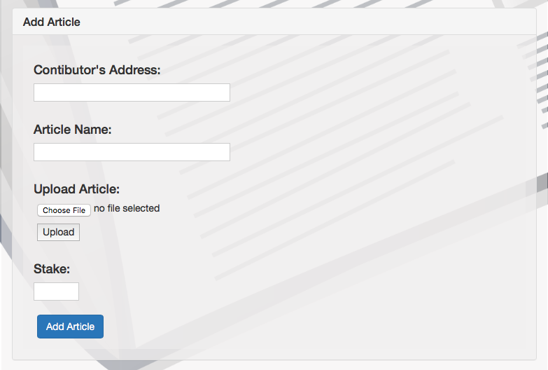
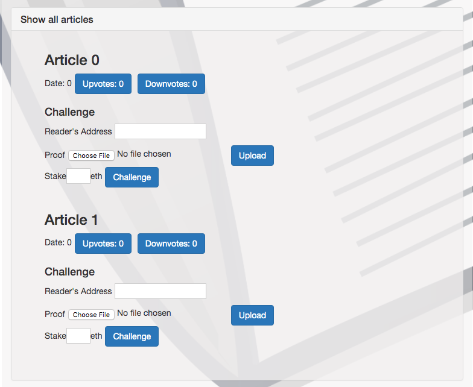

# honest_media

# Functionalities

The app shows that contract is operational:

User can register as a Contributor, Validator or Reader:

A Contributor can add an article:

Everyone can see the list of articles:

Validators can validate an article from the list of Articles waiting to be Approved:
